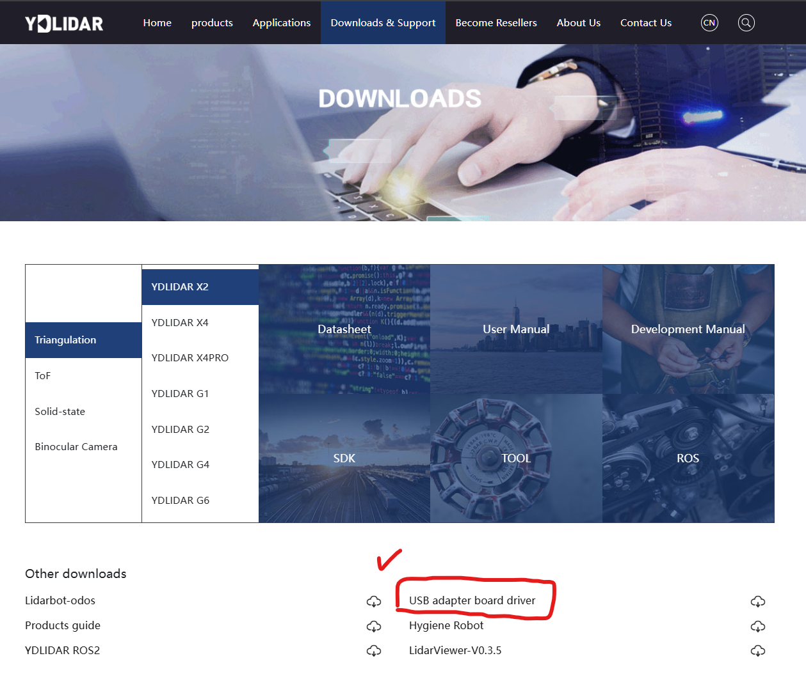
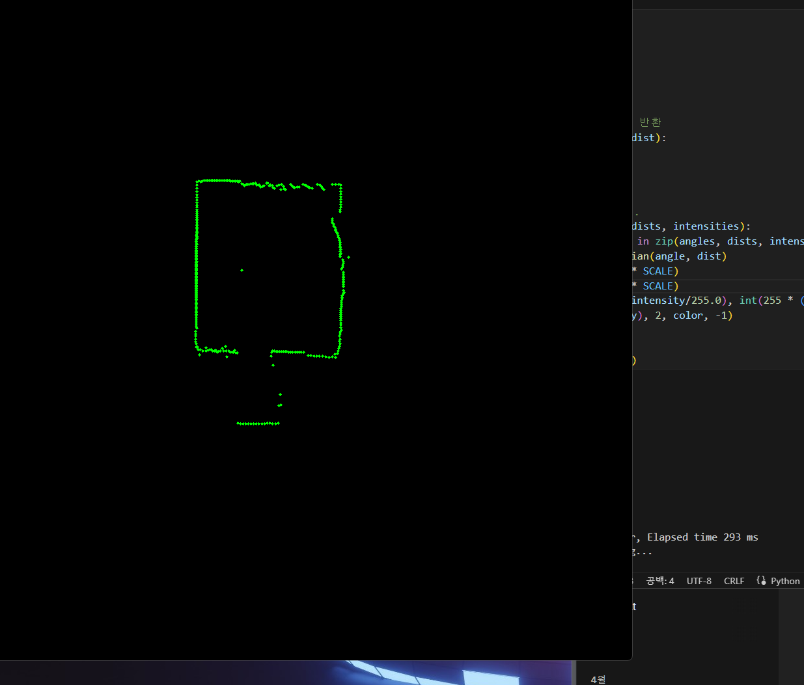

# WindNavigator
### Lidar Detection Using YDLidar X3 Pro
---
졸업 과제 WindNavigator에 사용될 라이다 센서가, 값을 읽고, 데이터를 얻는 작업 <br>


## 주의 사항
---
YDLidar를 파이썬에서 제대로 활용하기 위해서는 단순히 Serial 통신이 아닌 YDLidar-SDK를 필요로 합니다.<br>
따라서, YDLidar-SDK를 설치하기 위해서, 다음의 과정을 따라야합니다. 이는 YDLidar-SDK를 직접 다운로드 할 때에 필요합니다. <br>
다음은 [YDLidar-SDK의 공식 문서](https://github.com/YDLIDAR/YDLidar-SDK/blob/master/doc/howto/how_to_build_and_install.md)에서 설치 글귀를 인용하였습니다. 
또한, UART 통신을 위해서, USB 드라이버를 따로 설치하였습니다. 자세한 사항은 여기를 참조해 주세요.

### Cmake, SWIG 설치
YDLidar-SDK의 코드는 C언어를 기반으로 작성, Python으로도 이식할 수 있도록 만들어졌기 때문에, Cmake를 이용해 빌드를 하게 됩니다 <br>
또한, Python - C/C++ 코드를 연결시켜, 원활한 사용을 위해, SWIG를 꼭 설치해야합니다.
- **Ubuntu 22.04 LTS의 경우, Linux도 동일**
```bash
sudo apt update
sudo apt install cmake pkg-config swig
```
- **Windows 11의 경우**<br>
Windows의 경우에는 cmake를 따로 검색해서 설치하고, SWIG는 따로 압축을 풀고, 시스템 변수 PATH를 지정해야합니다.<br>
CMake 설치는 [여기](https://velog.io/@labghost/Window-Cmake-install) <br>
SWIG 설치는 [여기](https://www.youtube.com/watch?v=c6O_6_FbBnk&ab_channel=ITSH%21TS)를 참조하고, SWIG 설치 링크는 [여기](https://sourceforge.net/projects/swig/files/)에서 **녹색 버튼(swigwin-최신버전)** 으로 다운로드 <br>

### UART통신을 위한 USB 드라이버 
UART 통신을 위해서, USB 드라이버를 [공식사이트](https://www.ydlidar.com/service_support)에서 지원한다. 따라서, 공식사이트 하단의 USB adapter board driver를 받고 설치하자.


### YDLidar CMake 파일 다운로드, 빌드 및 Python 모듈 설치
- Bash든, PowerShell이든 전부 동일함
```bash
cd WindNavigator
# Clone YDLidar-SDK Source Code 
git clone https://github.com/YDLIDAR/YDLidar-SDK
cd YDLidar-SDK

# Python file Run
python setup.py build
python setup.py install
```
정상적으로 설치가 완료되었으면 OK.

### YDLidar 폴더
---
- **실제로 만들어진 YDLidar-SDK를 이용한 커스텀 YDLidar Class를 담고있음**
- **C언어로 정의된 모듈들이기 때문에 Python측에서 함수들을 읽어들이지 못함**
- **따라서, 하얀색 글씨만 나오게 됨**
- **각 모듈들에 따라서, Baudrate, 샘플링 주파수 등을 다르게 설정해야함. 여기서는 YDLidarX3 Pro의 값을 사용**
- 테스트 실행 결과 다음과 같이 나옴
  

